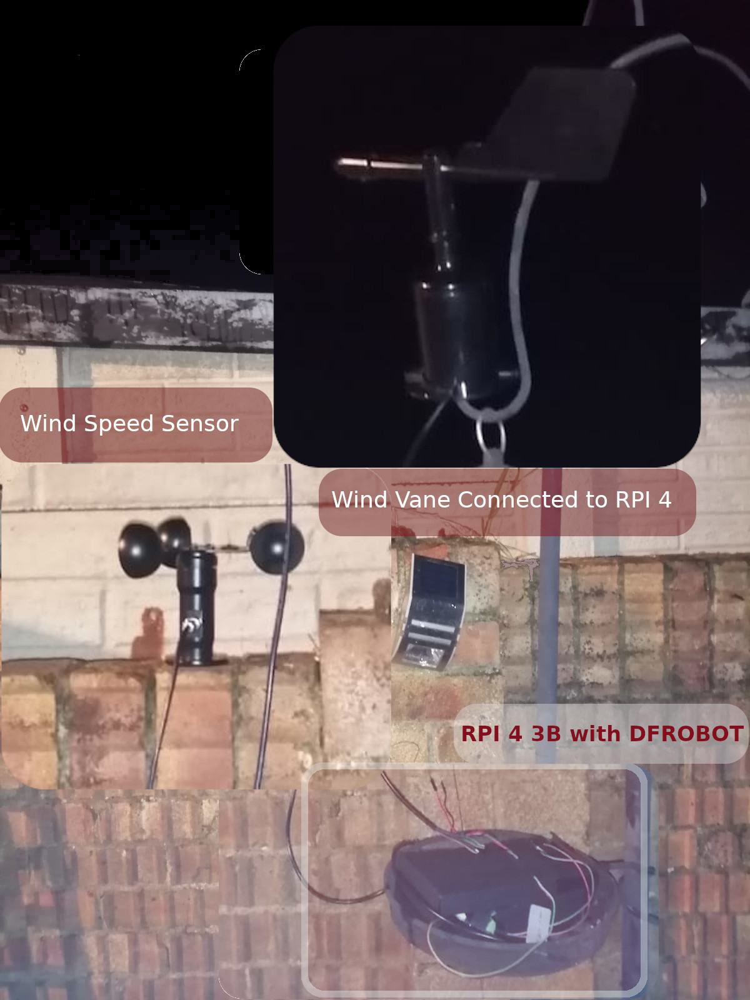
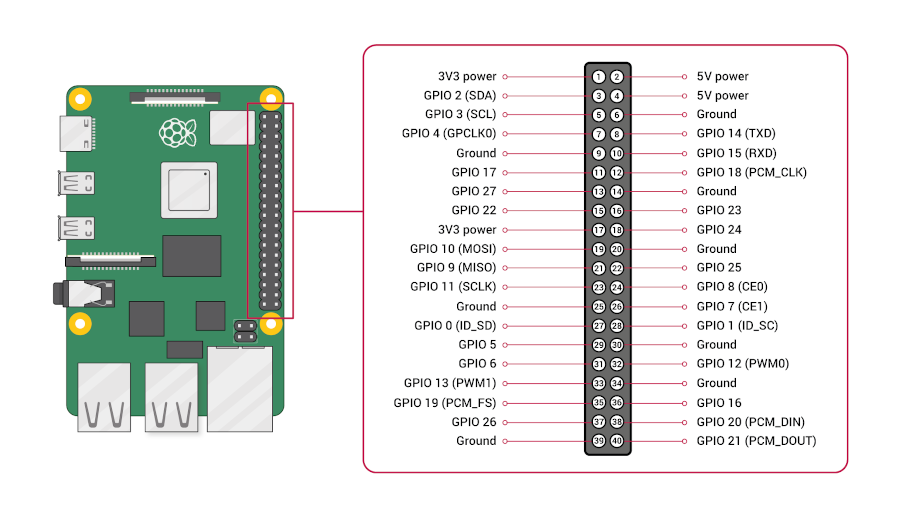

## Wind data project

The project measures wind speed and wind direction using high precision wind instruments. 

The components of the project prototype include:

(1) Raspberry Pi 4 B
(2) 12-24 V High Precision Environmental Sensors
(3) 10-30 V RS-FXJT-I20 Wind Vane
(4) Relay Module
(5) Ribbon Cable
(6) PCB/Breadboard

## How to execute the project

Run the Wind Data Daemon by using the command below:

```bash

python raspberry/run.py 5678 &

```

Run the Wind Data Scheduler by using the command below:

```bash

cd raspberry/ && python send.py 5678 | python schedule_hdf.py -p 5678 -g speed -sd speed_dataset.hdf5 -sl speed_log.log --simulate 1 -gu 1 --collect_random_samples 1 -rf 5

```

## Wind Data

With the wind data project, it is possible to record weather changes affecting wind speed and direction. A raspberry pi daemon which is calibrated to obtain precise wind speed and direction is run initially which collects data from the instruments on a routine basis. The Wind data Scheduler collects data by connecting to the daemon and records into HDF5 dataset.

## Dataset Logger

The project contains a dataset logger in HDF5. The direction and speed datasets are sized in decreasing order of frequency of data collection. The data is collected daily. Raspberry PI is chosen because it can setup cron jobs to run the data collection schedule and it gives greater power to operate the wind vane and wind speed sensors. 

## Project in detail

The project is used for environmental purposes, as a DIY toolkit. Wind data measurements are very useful to perform on a land where it is infeasible to use a dataset. This project has industrial applications because the components used for measurement are high precision components. 





The project is inspired from a Raspberry PI based project on Weather Station.

